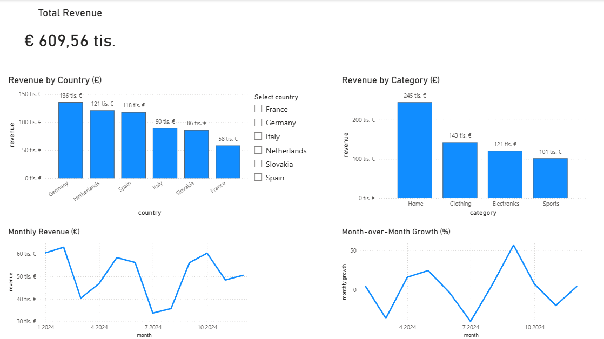
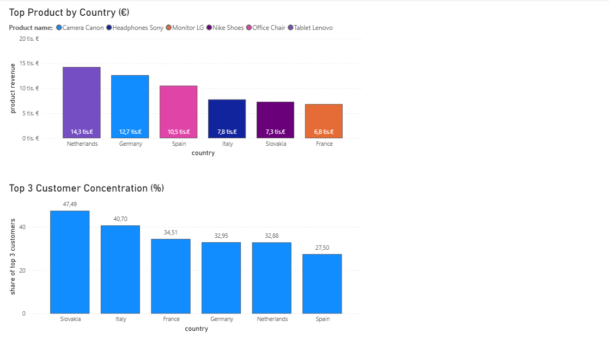

# 📊 Revenue Performance Analytics (SQL + Power BI)

This project focuses on analyzing e-commerce sales data using SQL and presenting key insights through an interactive Power BI dashboard.

## 🚀 Project Overview

The goal of this project was to:
- extract and transform data using SQL
- calculate key business metrics
- build an interactive dashboard in Power BI

The dataset simulates an e-commerce business with orders, products, and customers.

---

## 🧠 Key Insights

The dashboard answers questions such as:

- Which countries generate the most revenue?
- Which product categories perform best?
- How does revenue evolve over time?
- What is the month-over-month growth?
- Which products are top-performing in each country?
- How concentrated is revenue among top customers?

---

## 🛠️ Tech Stack

- **SQL (SQLite)** – data extraction and transformations  
- **Power BI** – data visualization and dashboard creation  

---

## 📂 Project Structure

```
revenue-performance-analytics/
│
├── data/              # datasets and exports
├── sql/               # SQL queries for analysis
├── dashboard/         # Power BI dashboard (.pbix)
├── images/            # dashboard screenshots
└── README.md
```

## 📈 Dashboard Preview

### Page 1 – Revenue Overview



### Page 2 – Product & Customer Insights



---

## 🔍 Key Metrics Explained

- **Total Revenue** – overall completed sales  
- **Revenue by Country** – comparison across markets  
- **Revenue by Category** – performance of product categories  
- **Monthly Revenue** – trend over time  
- **Month-over-Month Growth (%)** – month-to-month revenue change  
- **Top Product by Country** – highest revenue-generating product per country  
- **Top 3 Customer Concentration (%)** – share of total revenue generated by top 3 customers  

---

## 💡 What I Learned

- writing analytical SQL queries (aggregations, joins, window functions)
- working with structured datasets and understanding data relationships
- building interactive dashboards in Power BI
- designing meaningful business metrics and KPIs
- presenting insights in a clear and structured way

---

## 📌 Notes

This is a learning project focused on developing data analysis and visualization skills.